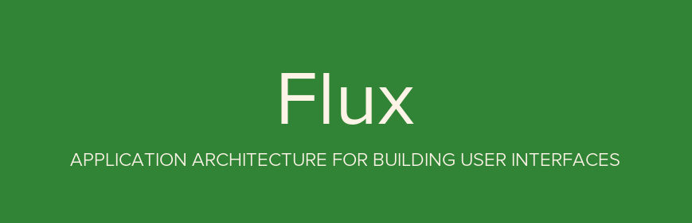
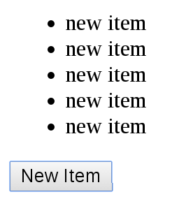

This demo helps you learn [Flux architecture](https://facebook.github.io/flux/). It is inspired by Andrew Ray's great article [Flux For Stupid People](http://blog.andrewray.me/flux-for-stupid-people/).

## What is Flux?

Flux, invented by Facebook, is an architecture pattern for building client-side web applications.

It is similar to MVC architecture, but Flux's concept is [much clearer](http://www.infoq.com/news/2014/05/facebook-mvc-flux) than MVC's, and easier to learn.



## How to Play?

Install the demo.

```bash
$ git clone git@github.com:ruanyf/extremely-simple-flux-demo.git
$ cd extremely-simple-flux-demo && npm install
$ npm start
```

Visit http://127.0.0.1:8080 with your browser.



You should see a button. Click it. That's all.

## Core Concepts

According to Flux, an application should be divided into four parts.

> - **Views**: the UI layer
> - **Actions**: messages sent from Views (e.g. mouseClick)
> - **Dispatcher**: a place receiving actions, and calling callbacks
> - **Stores**: a place managing the Application's state, and reminding Views to update


The key feature of the Flux archetecture is "one way" (unidirectional) data flow.

> 1. User interacts with Views
> 1. Views propagate an Action triggered by user
> 1. Dispatcher receives the Action and updates the Store
> 1. Store emits a "change" event
> 1. Views respond to the "change" event and update itself

Don't get it? Take it easy. I will give you the details soon.

## Demo Details

Now let us follow the demo to learn Flux.

First of all, Flux is usually used with React. So your familiarity with React is assumed. If not, I prepared a [React tutorial](https://github.com/ruanyf/react-demos) for you.

### Views

Our demo application's [`index.jsx`](https://github.com/ruanyf/extremely-simple-flux-demo/blob/master/index.jsx) has only one component.

```javascript
// index.jsx
var React = require('react');
var ReactDOM = require('react-dom');
var MyButtonController = require('./components/MyButtonController');

ReactDOM.render(
  <MyButtonController/>,
  document.querySelector('#example')
);
```

In the above code, you might notice our component's name isn't `MyButton`, but `MyButtonController`. Why?

Because I use React's [controller view pattern](http://blog.andrewray.me/the-reactjs-controller-view-pattern/) here. A controller view component holds all states, then passes this data to its descendants. `MyButtonController`'s [source code](https://github.com/ruanyf/extremely-simple-flux-demo/blob/master/components/MyButtonController.jsx) is simple.

```javascript
// components/MyButtonController.jsx
var React = require('react');
var ButtonActions = require('../actions/ButtonActions');
var MyButton = require('./MyButton');

var MyButtonController = React.createClass({
  createNewItem: function (event) {
    ButtonActions.addNewItem('new item');
  },

  render: function() {
    return <MyButton
      onClick={this.createNewItem}
    />;
  }
});

module.exports = MyButtonController;
```

In the above code, `MyButtonController` puts its data into UI component `MyButton`'s properties. `MyButton`'s [source code](https://github.com/ruanyf/extremely-simple-flux-demo/blob/master/components/MyButton.jsx) is even simpler.

```javascript
// components/MyButton.jsx
var React = require('react');

var MyButton = function(props) {
  return <div>
    <button onClick={props.onClick}>New Item</button>
  </div>;
};

module.exports = MyButton;
```

In the above code, you may find [`MyButton`](https://github.com/ruanyf/extremely-simple-flux-demo/blob/master/components/MyButton.jsx) is a pure component (meaning stateless), which is really the biggest advantage of the controll view pattern.

Here, the logic of our application is when user clicks `MyButton`, the [`this.createNewItem`](https://github.com/ruanyf/extremely-simple-flux-demo/blob/master/components/MyButtonController.jsx#L27) method will be called. It sends an action to Dispatcher.

```javascript
// components/MyButtonController.jsx

  // ...
  createNewItem: function (event) {
    ButtonActions.addNewItem('new item');
  }
```

In the above code, calling the `createNewItem` method will trigger an `addNewItem` action.

### What is an Action?

An action is an object which has some properties to carry data and an `actionType` property to identify the action type.

In our demo, the [`ButtonActions`](https://github.com/ruanyf/extremely-simple-flux-demo/blob/master/actions/ButtonActions.js) object is the place we hold all actions.

```javascript
// actions/ButtonActions.js
var AppDispatcher = require('../dispatcher/AppDispatcher');

var ButtonActions = {
  addNewItem: function (text) {
    AppDispatcher.dispatch({
      actionType: 'ADD_NEW_ITEM',
      text: text
    });
  },
};
```

In the above code, the `ButtonActions.addNewItem` method will use `AppDispatcher` to dispatch the `ADD_NEW_ITEM` action to the Stores.

### Dispatcher

The Dispatcher transfers the Actions to the Stores. It is essentially an event hub for your application's Views. There is only one global Dispatcher.

We use the [Facebook official Dispatcher Library](https://github.com/facebook/flux), and write a [`AppDispatcher.js`](https://github.com/ruanyf/extremely-simple-flux-demo/blob/master/dispatcher/AppDispatcher.js) as our application's dispatcher instance.

```javascript
// dispatcher/AppDispatcher.js
var Dispatcher = require('flux').Dispatcher;
module.exports = new Dispatcher();
```

`AppDispatcher.register()` is used for registering a callback for actions.

```javascript
// dispatcher/AppDispatcher.js
var ListStore = require('../stores/ListStore');

AppDispatcher.register(function (action) {
  switch(action.actionType) {
    case 'ADD_NEW_ITEM':
      ListStore.addNewItemHandler(action.text);
      ListStore.emitChange();
      break;
    default:
      // no op
  }
})
```

In the above code, when receiving the `ADD_NEW_ITEM` action, the callback will operate the `ListStore`.

Please keep in mind, Dispatcher has no real intelligence on its own — it is a simple mechanism for distributing the actions to the stores.

### Stores

The Stores contain the application state. Their role is somewhat similar to a model in a traditional MVC.

In this demo, we have a [`ListStore`](https://github.com/ruanyf/extremely-simple-flux-demo/blob/master/stores/ListStore.js) to store data.

```javascript
// stores/ListStore.js
var ListStore = {
  items: [],

  getAll: function() {
    return this.items;
  },

  addNewItemHandler: function (text) {
    this.items.push(text);
  },

  emitChange: function () {
    this.emit('change');
  }
};

module.exports = ListStore;
```

In the above code, `ListStore.items` is used for holding items, `ListStore.getAll()` for getting all these items, and `ListStore.emitChange()` for emitting an event to the Views.

The Stores should implement an event interface as well. Since after receiving an action from the Dispatcher, the Stores should emit a change event to tell the Views that a change to the data layer has occurred.

```javascript
// stores/ListStore.js
var EventEmitter = require('events').EventEmitter;
var assign = require('object-assign');

var ListStore = assign({}, EventEmitter.prototype, {
  items: [],

  getAll: function () {
    return this.items;
  },

  addNewItemHandler: function (text) {
    this.items.push(text);
  },

  emitChange: function () {
    this.emit('change');
  },

  addChangeListener: function(callback) {
    this.on('change', callback);
  },

  removeChangeListener: function(callback) {
    this.removeListener('change', callback);
  }
});
```

In the above code, `ListStore` inheritances `EventEmitter.prototype`, so you can use `ListStore.on()` and `ListStore.emit()`.

After updated(`this.addNewItemHandler()`), the Stores emit an event(`this.emitChange()`) declaring that their state has changed, so the Views may query the new state and update themselves.

### Views, again

Now, we come back to [the Views](https://github.com/ruanyf/extremely-simple-flux-demo/blob/master/components/MyButtonController.jsx) for implementing an callback for listening the Store's `change` event.

```javascript
// components/MyButtonController.jsx
var React = require('react');
var ListStore = require('../stores/ListStore');
var ButtonActions = require('../actions/ButtonActions');
var MyButton = require('./MyButton');

var MyButtonController = React.createClass({
  getInitialState: function () {
    return {
      items: ListStore.getAll()
    };
  },

  componentDidMount: function() {
    ListStore.addChangeListener(this._onChange);
  },

  componentWillUnmount: function() {
    ListStore.removeChangeListener(this._onChange);
  },

  _onChange: function () {
    this.setState({
      items: ListStore.getAll()
    });
  },

  createNewItem: function (event) {
    ButtonActions.addNewItem('new item');
  },

  render: function() {
    return <MyButton
      items={this.state.items}
      onClick={this.createNewItem}
    />;
  }
});
```

In the above code, you could see when `MyButtonController` finds out the Store's `change` event occurred, it calls `this._onChange` to update the component's state, then trigger a re-render.

```javascript
// components/MyButton.jsx
var React = require('react');

var MyButton = function(props) {
  var items = props.items;
  var itemHtml = items.map(function (listItem, i) {
    return <li key={i}>{listItem}</li>;
  });

  return <div>
    <ul>{itemHtml}</ul>
    <button onClick={props.onClick}>New Item</button>
  </div>;
};

module.exports = MyButton;
```

## License

MIT
